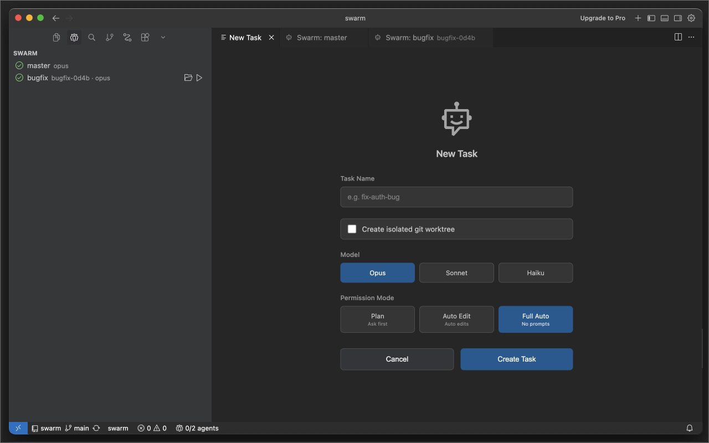
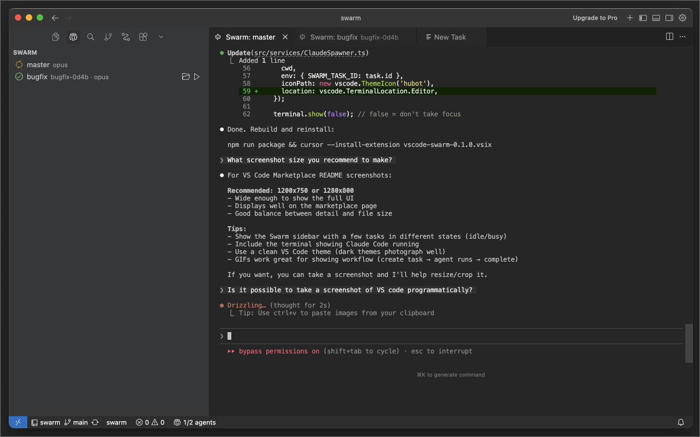
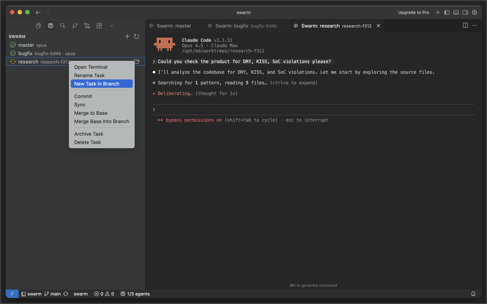

# Swarm for Claude Code

Run multiple Claude Code agents in parallel, each in its own git worktree.

## Features

- **Parallel Agents**: Spawn multiple Claude Code sessions simultaneously
- **Worktree Isolation**: Each task runs in its own git worktree for clean separation
- **Activity Tracking**: Monitor agent status (busy/idle/stopped) in the sidebar
- **Git Integration**: Commit, push, and merge task branches from the context menu
- **Session Persistence**: Resume conversations after VS Code restarts

## Usage

1. Click the Swarm panel in the activity bar
2. Click **+** to create a new Swarm agent
3. Choose model and whether to use a git worktree (recommended for parallel work)
4. The agent starts automatically

### Task Options

- **Model**: opus, sonnet, or haiku
- **Permission Mode**: plan, autoEdit, or fullAuto (skips all prompts)
- **Worktree**: Enable for isolated git branch

### Context Menu

Right-click a task to:

- Open Terminal
- Open Worktree in New Window
- Commit / Push / Merge to Base
- Delete Task

## Requirements

- Git
- [Claude Code CLI](https://claude.ai/claude-code) installed and authenticated

## Extension Settings

- `swarm.defaultModel`: Default model for new tasks (opus/sonnet/haiku)
- `swarm.defaultPermissionMode`: Default permission mode (plan/autoEdit/fullAuto)
- `swarm.preservedFiles`: Files to copy to new worktrees (.env, etc.)
- `swarm.notifications`: Show notifications when tasks complete

## Suggested Extensions

- `Git Worktree Manager`: to manage worktrees created by Swarm agents
- `Claude Code for VS Code`: to integrate Claude Code into VSCode

## License

MIT
